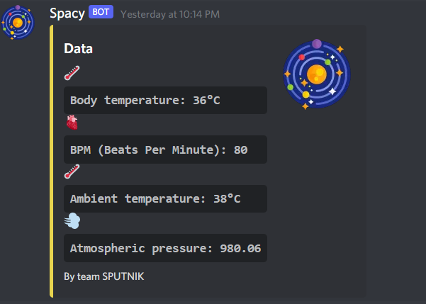
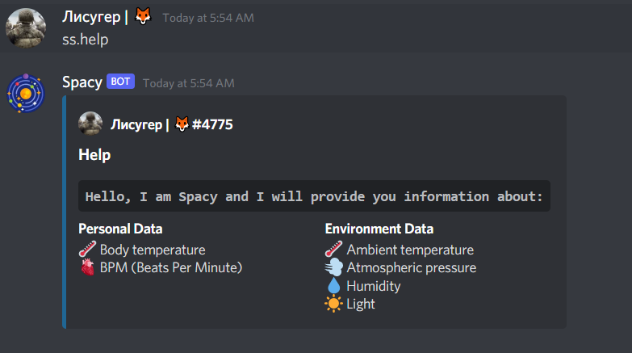

# Safe Cosmos Costume

## 1. Увод

> От хилядолетия човечеството е заинтересовано от необятния Космос. Чак през 1961-ва година човек напуска Земята - 
***[Юрий Гагарин](https://bg.wikipedia.org/wiki/%D0%AE%D1%80%D0%B8%D0%B9_%D0%93%D0%B0%D0%B3%D0%B0%D1%80%D0%B8%D0%BD)*** е първият в света, извършил полет от такова естество. Днес на височина 400 км. със скорост 27 743 км/ч, обикаля лаборатория, която е голяма колкото футболен стадион - [***Международната космическа станция***](https://bg.wikipedia.org/wiki/%D0%9C%D0%B5%D0%B6%D0%B4%D1%83%D0%BD%D0%B0%D1%80%D0%BE%D0%B4%D0%BD%D0%B0_%D0%BA%D0%BE%D1%81%D0%BC%D0%B8%D1%87%D0%B5%D1%81%D0%BA%D0%B0_%D1%81%D1%82%D0%B0%D0%BD%D1%86%D0%B8%D1%8F), в която се провеждат експерименти, изследователска дейност и т.н. Но както ни показва историята, всичко, направено от човека, е склонно да се развали в някой момент, което може да отнеме нечий живот. От тази гледна точка една авария на МКС не е изключена. Именно тук се намесва нашият проект.

## 2. Идея

> Първоначалната ни идея беше да разположим множество от най-различни сензори по дреха, която ще може да се облича лесно от един космонавт по време на авария. Тя ще му помага в неблагоприятните условия, като:

> **1.** **``предоставя информация``** за случващото се около и със самия него:    
**а)** температурата на неговото тяло и тази на околната среда;  
**b)** сърдечен ритъм;    
**c)** влажност на въздуха;    
**d)** атмосферно налягане; 
>
> **2.** ако спре осветлението и настъпи мрак, ще се задейства **``системата за осветяване``**, която се контролира чрез движение на ръката;
>
> **3.** има **``звукова индикация``** за близък обек в радиус от около 75 cm, за да се предотврати удар;
>
> **4.** RTC (Real-time clock) - представа за времето;

## 3. Реализация

### 3.1. Идея => Реалност

> Както много често се случва в живота, не всичко, което сме си намислили, върви по план и се случва. До този извод стигна и нашият отбор, след като имаше леки разлики между заплануваното и реализираното:
>
> **1.** Като за начало, нашата **``дреха``** се превърна в **``кутия``**. Повечето функционалности бяха побрани в нея, тъй като не ни достигна времето, за да довършим започнатото.
>
> **2.** RTC беше направен, но за съжаление преценихме, че той е излишен, тъй като голяма част от астронавтите разполагат с часовник и той се обезсмисля.
>
> **3.** Webhook-ът може да праща съобщение от Ардуиното към Discord, но то все още не съдържа в себе си събраните данни.

### 3.2. Решение

#### 3.2.1. Гривна
> С помощта на дисплей информацията за телесната и стайната температура, влажността и атмосферното налягане се визуализират.

#### 3.2.2. Насочваща система
> Чрез движение на ръката, задаване на посока, се определя накъде да се освети. 
>
> Освен това човекът бива известяван за обекти в радиус от около 75 cm, за да се предотврати удар.

#### 3.2.3. Webhook
> **``Webhook``** е технология, която ни позволява да свържем проекта и Discord, за да може събраната информация от сензорите да се вижда и онлайн**(a)**. Това става чрез request **(b)**, който се праща от Ардуиното към webhook-а чрез request метода [**``POST``**](https://en.wikipedia.org/wiki/POST_(HTTP)).

**(a)**
>    

**(b)**
```ino
    int httpResponseCode = http.POST("{\"embeds\":\[\{\"title\":\"Data\",\"description\":\":thermometer: **```Body temperature: 36°C```**:anatomical_heart: **```BPM (Beats Per Minute): 80```**:thermometer: **```Ambient temperature: 38°C```**:dash: **```Atmospheric pressure: 980.06```**\",\"color\":15258703,\"thumbnail\":\{\"url\":\"https://cdn.discordapp.com/avatars/951801611771080714/655f3fd85fc43481b9f332630b2032b6.webp?size=1024\"\},\"footer\":\{\"text\":\"By team SPUTNIK\"\}\}\]}");
```

#### 3.2.4. Discord bot
> Нашият бот се казва **``Spacy``**. Тя представлява лицето на проекта в Discord. По план трябваше тя да бъде свързана с db(**``MongoDB``**), в което щеше да се пази статистика от данните, събрани от сензорите, но времето не достигна и този feature не е имплементиран. За момента Spacy разполага с една команда, която изпраща embed в чата **(c)** за функционалността на бота.

**(c)**
>    
